<div align="center">

# ⚡ Agentic Code Fixer

**Autonomous Closed-Loop Code Repair & Self-Correction Pipeline**

[](https://github.com/Sabarixx/agentic-code-fixer)

<p align="center">
  <a href="https://github.com/Sabarixx/agentic-code-fixer/releases"></a>
  <a href="https://python.org"></a>
  <a href="https://langchain-ai.github.io/langgraph/"></a>
  <a href="https://groq.com"></a>
  <a href="#-verification--tests"></a>
  <a href="LICENSE"></a>
</p>

</div>

---

## 📖 1. Project Overview

**Agentic Code Fixer** is an autonomous, multi-agent code generation, execution, and self-correction engine built with LangGraph. Designed for software engineering teams, CI/CD pipelines, and autonomous AI agents, it turns failing code snippets and broken test suites into verified, deterministic patches. 

Unlike traditional "one-shot" LLMs that guess code without execution feedback, Agentic Code Fixer enforces a mathematical closed-loop: it analyzes Abstract Syntax Tree (AST) invariants, diagnoses causal failure frames, generates minimal surgical diffs, and re-executes tests in an isolated sandbox before emitting an audit-verified solution.

> [!IMPORTANT]
> **Zero Hallucination Perimeter**: Every synthesized patch is executed against real test contracts in an ephemeral sandbox. Code is only marked as verified when 100% of test assertions pass.

---

## ✨ 2. Features and Benefits

| Category | Capability | Value & Benefit |
| :--- | :--- | :--- |
|  | **5-Phase Self-Healing State Machine** | Moves systematically through *Analysis*, *Diagnosis*, *Patch Synthesis*, *Sandbox Re-Run*, and *Receipt Validation* to eliminate recursive failure loops. |
|  | **Surgical Invariant Repair** | Emits the smallest possible idempotent patch rather than rewriting entire files, preserving code style and avoiding side-effect regressions. |
|  | **Zero-Leak Isolated Execution** | Executes test suites in sandboxed containers with strict memory limits, timeouts, and restricted syscalls to safeguard your environment. |
|  | **Deterministic Proof Receipts** | Emits cryptographic execution traces and confidence ratings (e.g., `0.98`) to enable zero-friction pull request approvals. |
|  | **Multi-Surface Accessibility** | Ships with a modern Streamlit workspace, a standalone HTML5/JS web dashboard, and an interactive animated technical presentation deck. |
|  | **Parallel Async Reasoning** | Powered by high-throughput Groq and Google Gemini inference to deliver verified fixes in under 1.5 seconds per iteration. |

---

## 💻 3. Installation Instructions

### Prerequisites
- **Python**: `3.10` or higher (`3.10`, `3.11`, `3.12`, or `3.14`)
- **Package Manager**: `pip`, `uv`, or `poetry`
- **Git**: For version management
- **LLM API Key**: A free [Groq API Key](https://console.groq.com) or [Google AI Studio API Key](https://aistudio.google.com)

---

### Step 1: Clone the Repository
```bash
git clone https://github.com/Sabarixx/agentic-code-fixer.git
cd agentic-code-fixer
```

### Step 2: Create and Activate Virtual Environment
```bash
# On Linux / macOS
python3 -m venv venv
source venv/bin/activate

# On Windows (PowerShell)
python -m venv venv
.\venv\Scripts\Activate.ps1
```

### Step 3: Install Dependencies
```bash
pip install -r requirements.txt
```

### Step 4: Configure Environment Variables
Copy `.env.example` to `.env` and provide your API keys:
```bash
cp .env.example .env
```

Edit `.env`:
```ini
# LLM Providers (Groq recommended for high-speed inference)
GROQ_API_KEY="gsk_your_groq_api_key_here"
GROQ_MODEL="llama-3.3-70b-versatile"

# Optional: Google Gemini fallback
GEMINI_API_KEY="your_gemini_api_key_here"
GEMINI_MODEL="gemini-2.0-flash"

# Sandbox & Execution settings
SANDBOX_TIMEOUT_SECONDS=10
MAX_REPAIR_RETRIES=3
LOG_LEVEL="INFO"
```

### Step 5: Verify Installation
Run the complete contract test suite to confirm setup integrity:
```bash
pytest
```
*Expected output: `40 passed in 0.36s`*

---

## 🚀 4. Usage Guidelines

### 4.1 Quick Start: CLI Pipeline Execution
Run the agentic repair pipeline across all 8 curated specification benchmarks:
```bash
python main.py
```

To run a single target specification:
```bash
python main.py --spec specs/spec_01_two_sum.json
```

---

### 4.2 Interactive Streamlit Workspace
Launch the full interactive studio with visual diff inspector and live LangGraph stepper:
```bash
streamlit run ui/app.py
```
Open [`http://localhost:8501`](http://localhost:8501) in your browser to test custom broken code snippets interactively.

---

### 4.3 Web Dashboard & Animated Presentation
To explore the standalone web interface and animated slide deck:
```bash
# Option A: Open directly in browser
start web/index.html

# Option B: Run local HTTP server
python -m http.server 3000 --directory web
```
- **Live App**: [`http://localhost:3000/index.html`](http://localhost:3000/index.html)
- **Animated Deck**: [`http://localhost:3000/presentation.html`](http://localhost:3000/presentation.html)

---

### 4.4 Python Programmatic SDK
Integrate the self-correction engine directly into your custom Python application or agent:

```python
from agent.graph import create_fixer_graph

# 1. Define broken code and the expected test contract
broken_code = """
def divide_values(a: float, b: float) -> float:
    return a / b  # Fails when b == 0
"""

test_contract = """
def test_divide_zero():
    assert divide_values(10, 0) == 0.0

def test_divide_normal():
    assert divide_values(10, 2) == 5.0
"""

# 2. Instantiate and invoke the multi-agent graph
graph = create_fixer_graph()
initial_state = {
    "broken_code": broken_code,
    "test_contract": test_contract,
    "language": "python",
    "iteration": 0,
    "max_iterations": 3
}

final_state = graph.invoke(initial_state)

# 3. Access verified patch and proof receipt
if final_state.get("status") == "VERIFIED":
    print("✅ Verified Patch Synthesized:")
    print(final_state["fixed_code"])
    print(f"Confidence Score: {final_state['confidence']}")
```

---

### 4.5 Configuration Parameters

| Parameter | Type | Default | Description |
| :--- | :--- | :--- | :--- |
| `max_iterations` | `int` | `3` | Maximum self-correction repair loops before aborting. |
| `sandbox_timeout` | `float` | `10.0` | Execution time fence (in seconds) for isolated test runs. |
| `enable_ast_pruning` | `bool` | `True` | Restricts patch synthesis to localized AST error frames. |
| `confidence_threshold`| `float` | `0.90` | Minimum Bayesian confidence score required for approval. |
| `allow_refactor` | `bool` | `True` | Performs secondary cleanliness pass if tests pass on attempt 1. |

---

## 🤝 5. Contribution Guidelines

We welcome contributions from the community! Follow these standards to ensure a smooth collaboration process.

### Development Environment Setup
1. Fork and clone the repository.
2. Create a dedicated feature branch:
   ```bash
   git checkout -b feat/your-feature-name
   ```
3. Install development tooling:
   ```bash
   pip install -r requirements-dev.txt
   pre-commit install
   ```

### Commit Message Conventions
We adhere to [Conventional Commits](https://www.conventionalcommits.org/):
- `feat:` Introduces a new feature or node in the pipeline
- `fix:` Fixes a bug in graph routing or AST parsing
- `docs:` Documentation or storyboard updates
- `test:` Adds new test specifications or sandbox fixtures
- `refactor:` Code refactoring with zero behavior change

### Pull Request & Review Criteria
1. **Test Coverage**: All changes must maintain $100\%$ pass rates on existing unit tests (`pytest`).
2. **Linting & Typing**: Ensure zero lint errors via `ruff check .` and `mypy .`.
3. **Receipt Trace**: Include the execution trace output or screenshot in your PR description.

> [!NOTE]
> Please review our [Code of Conduct](CODE_OF_CONDUCT.md) before participating in discussions or submitting PRs.

---

## 📬 6. Contact and Support Information

| Channel | Destination | Details & SLA |
| :--- | :--- | :--- |
| 🐛 **Issue Tracker** | [GitHub Issues](https://github.com/Sabarixx/agentic-code-fixer/issues) | Bug reports & feature requests (Response within 24h) |
| 💬 **Discussions** | [GitHub Discussions](https://github.com/Sabarixx/agentic-code-fixer/discussions) | Architectural questions & community showcase |
| 📚 **Documentation** | [Project Docs](docs/) | Detailed state schema & node design docs |
| ⚡ **Live Deck** | [`web/presentation.html`](web/presentation.html) | Interactive technical animation & video storyboard |
| 💼 **Enterprise Support** | `contact@agenticfixer.dev` | Custom on-prem sandboxes & bespoke model integrations |

---

<div align="center">
  <sub>Built with ❤️ by the <b>Agentic Code Fixer</b> Team · Distributed under the <a href="LICENSE">MIT License</a>.</sub>
</div>
