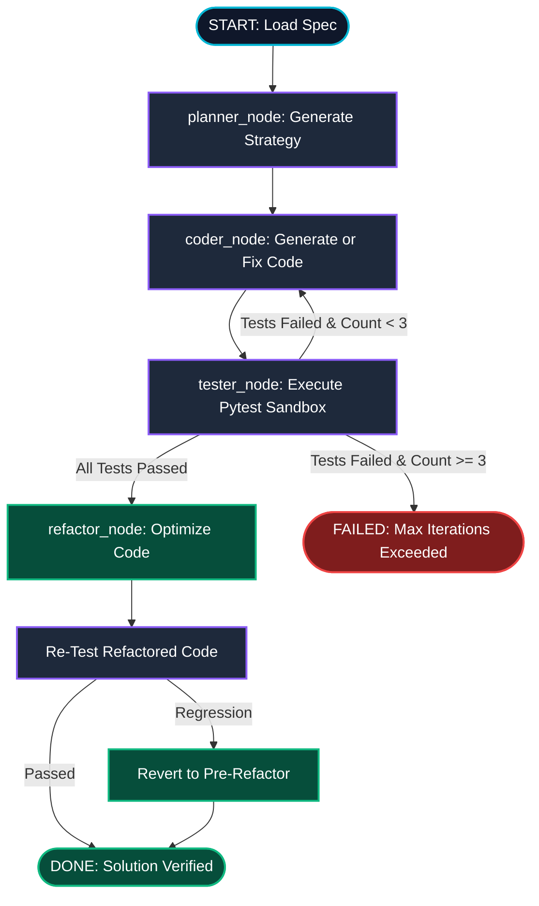

<!--
  AGENTIC CODE FIXER - README
  Theme Palette:
    - Primary Cyan:   #06B6D4
    - Deep Purple:    #8B5CF6
    - Emerald Green:  #10B981
    - Dark Slate:     #0F172A
-->

<!-- PROJECT BANNER -->
<p align="center">
  
</p>

<h1 align="center">⚡ Agentic Code Fixer</h1>

<p align="center">
  <b>An Autonomous Multi-Agent Code Generation, Execution & Self-Correction Pipeline built with LangGraph</b>
</p>

<p align="center">
  <a href="#-badges--status"></a>
  <a href="https://python.org"></a>
  <a href="https://langchain-ai.github.io/langgraph/"></a>
  <a href="https://groq.com"></a>
  <a href="#-verification--tests"></a>
  <a href="LICENSE"></a>
</p>

---

## 📌 Table of Contents

<p align="center">
  <a href="#-overview">Overview</a> •
  <a href="#-key-architecture">Key Architecture</a> •
  <a href="#-curated-problem-specs">Curated Specs</a> •
  <a href="#-quick-start">Quick Start</a> •
  <a href="#-observability--tracing">Observability</a> •
  <a href="#-repository-structure">Repo Structure</a> •
  <a href="#-state-schema-technical-reference-click-to-expand">State Schema</a> •
  <a href="#-author--license">Author & License</a>
</p>

---

## 🎯 Overview

**Agentic Code Fixer** is an 8-week structured project implementing a closed-loop multi-agent system designed to plan, generate, evaluate, and refactor Python function implementations autonomously.

Rather than relying on single-shot LLM prompts, the architecture models code synthesis as a state-machine graph (using **LangGraph**). When generated code fails unit tests, error tracebacks are fed back into the agentic loop to perform target-driven self-correction.

```text
[ Function Spec ] ➔ ( Planner Node ) ➔ ( Coder Node ) ➔ ( Tester Node ) ➔ [ Passed / Refactored Code ]
                                               ▲                  │
                                               └─ (Retry Loop) ───┘ (if tests fail & count < 3)
```

---

## 🛠️ Key Architecture

The core graph connects distinct functional roles via shared typed state (`AgentState`). Below is the system flow and conditional control topology:



### 👥 Agent Node Responsibilities

| Icon | Node | Responsibilities | Output State Field |
| :---: | :--- | :--- | :--- |
| 🧠 | `planner_node` | Analyzes spec constraints, identifies edge cases, selects algorithmic strategy. | `state["plan"]` |
| 💻 | `coder_node` | Writes function implementation matching spec signature & plan guidelines. | `state["code"]` |
| 🧪 | `tester_node` | Runs sandboxed `pytest` execution, extracts pass/fail metrics & tracebacks. | `state["test_results"]` |
| 🎨 | `refactor_node` | Enhances readability & complexity of verified code without regressing logic. | `state["code"]` |

---

## 📚 Curated Problem Specs

The evaluation benchmark contains **8 curated function specifications** spanning classic Data Structures & Algorithms (DSA), each backed by a 5-test reference suite (**40 total ground-truth tests**).

| ID | Problem Title | Algorithmic Category | Reference Tests | Status |
| :---: | :--- | :--- | :---: | :---: |
| `spec_01` | **Two Sum** | Hash Map / Two Pointers | 5 / 5 Passed | `refactored` |
| `spec_02` | **Reverse Linked List** | Pointer Manipulation | 5 / 5 Passed | `refactored` |
| `spec_03` | **Valid Parentheses** | Stack | 5 / 5 Passed | `refactored` |
| `spec_04` | **Merge Intervals** | Sorting / Interval Array | 5 / 5 Passed | `refactored` |
| `spec_05` | **Group Anagrams** | Hash Table / String Categorization | 5 / 5 Passed | `refactored` |
| `spec_06` | **Search in Rotated Sorted Array** | Modified Binary Search | 5 / 5 Passed | `refactored` |
| `spec_07` | **LRU Cache** | Doubly Linked List + Hash Map | 5 / 5 Passed | `refactored` |
| `spec_08` | **Topological Sort** | Graph DAG / Kahn's Algorithm | 5 / 5 Passed | `refactored` |

---

## 📈 Final Results

> Full evaluation run completed across all 8 specs in Week 6. Archive: [`traces/final_run/`](traces/final_run/) · Summary: [`traces/week6_summary.md`](traces/week6_summary.md)

| Metric | Value |
| :--- | :--- |
| Specs Evaluated | **8 / 8** |
| Tests Passing | **40 / 40** |
| Refactor Passes Kept | **8 / 8** |
| Retry Loop Organically Triggered | 0 (all passed first attempt) |
| Average Iterations per Spec | 2 |

---

## ⚡ Demo

Run the full 4-node pipeline on any spec in one command:

```powershell
# Run demo on Two Sum (default)
.\venv\Scripts\python.exe scratch/run_demo.py spec_01

# Run demo on LRU Cache
.\venv\Scripts\python.exe scratch/run_demo.py spec_07
```

The demo prints each stage (`[PLAN]`, `[CODE]`, `[TEST]`, `[REFACTOR]`) as it executes, and exits with code `0` on success, `1` on failure.

### Pre-Demo Environment Check

```powershell
# Verify all 52 environment checks before a live demo
.\venv\Scripts\python.exe scratch/verify_fresh_clone.py
```

---

## 🗓️ Week-by-Week Progress

| Week | Focus | Status |
| :---: | :--- | :---: |
| **Week 1** | Environment setup, LangGraph skeleton (`planner→coder→tester`), architecture contract locked | ✅ Done |
| **Week 2** | `planner_node` — structured `PlanOutput` Pydantic model, 8 plans generated & audited | ✅ Done |
| **Week 3** | `coder_node` — regex extraction, AST validation, `tools/file_writer.py`, 8 implementations generated | ✅ Done |
| **Week 4** | `tester_node` — sandboxed `pytest` subprocess, `TestResult` schema, 8/8 specs passing | ✅ Done |
| **Week 5** | Conditional retry loop — `route_after_tester`, failure injection into retry prompt, 8/8 refactored | ✅ Done |
| **Week 6** | `refactor_node` — discard-on-regression safety net, exponential backoff, full 8-spec evaluation run | ✅ Done |
| **Week 7** | Self-evaluation doc (`docs/self_eval.md`), demo script, fresh-clone verifier, README polish | ✅ Done |
| **Week 8** | Final submission preparation | 🔜 Next |

---

## 🚀 Quick Start

### 1. Prerequisites & Virtual Environment

Clone the repository and initialize the Python 3.10+ virtual environment:

```powershell
# Clone repository
git clone https://github.com/Sabarixx/agentic-code-fixer.git
cd agentic-code-fixer

# Create and activate virtual environment (PowerShell)
python -m venv venv
.\venv\Scripts\Activate.ps1

# Install requirements
pip install -r requirements.txt
```

### 2. Environment Variables Configuration

Copy the example environment file and configure your API credentials:

```powershell
copy .env.example .env
```

Edit `.env` to supply your Groq / Gemini API key:

```env
GROQ_API_KEY="your_groq_api_key_here"
LANGCHAIN_TRACING_V2=true
LANGCHAIN_API_KEY="your_langsmith_api_key_here"
LANGCHAIN_PROJECT="agentic-code-fixer"
```

### 3. Execution & Verification

Run the components using the virtual environment:

```powershell
# 1. Verify LLM API Access (Day 1)
.\venv\Scripts\python.exe scratch/test_llm.py

# 2. Run LangGraph Skeleton Pipeline (Day 3)
.\venv\Scripts\python.exe agent/graph.py

# 3. Execute 40 Reference Ground-Truth Tests (Day 7)
.\venv\Scripts\python.exe -m pytest specs/tests/
```

---

## 📊 Observability & Tracing

Full execution observability is powered by **LangSmith**. Every graph run logs node-level inputs, outputs, tokens, and execution latency.

```powershell
# Ensure tracing is enabled in .env
LANGCHAIN_TRACING_V2=true
LANGCHAIN_PROJECT=agentic-code-fixer
```

When running `python agent/graph.py`, inspect traces in your [LangSmith Dashboard](https://smith.langchain.com/) to analyze node timing and state transitions.

---

## 📁 Repository Structure

```text
agentic-code-fixer/
├── 📂 agent/                 # Core LangGraph implementation
│   ├── 📄 state.py           # TypedDict AgentState schema & Status enum
│   └── 📄 graph.py           # Compiled StateGraph & node definitions
├── 📂 docs/                  # Project architecture & documentation
│   └── 📄 architecture.md    # Locked architecture contract & design spec
├── 📂 specs/                 # Evaluation benchmark domain
│   ├── 📄 spec_01.json ...   # Problem definitions & function signatures
│   ├── 📂 reference/         # Ground-truth reference implementations
│   └── 📂 tests/             # 5 pytest unit tests per specification
├── 📂 scratch/               # Prototyping scripts & LLM smoke tests
│   └── 📄 test_llm.py
├── 📂 assets/                # README visual assets & banners
│   └── 🖼️ banner.jpg         # Cyber duotone header banner
├── 📄 requirements.txt       # Project dependencies
├── 📄 README.md              # Project documentation
└── 📄 pytest.ini             # Pytest configuration
```

---

<details>
<summary><b>🔍 State Schema Technical Reference (Click to Expand)</b></summary>

<br/>

### `AgentState` TypedDict Fields

The system state is locked per [`docs/architecture.md`](file:///d:/Agentic-AI/agentic-code-fixer/docs/architecture.md):

| Field | Type | Default | Description |
| :--- | :--- | :--- | :--- |
| `spec` | `dict[str, Any]` | `{}` | Loaded problem specification (name, signature, docstring, constraints). |
| `plan` | `str` | `""` | Algorithmic strategy & edge case handling produced by Planner node. |
| `code` | `str` | `""` | Generated Python code candidate. |
| `test_results` | `dict[str, Any]` | `{}` | Sandbox execution report (passed count, failed count, tracebacks). |
| `iteration_count` | `int` | `0` | Count of Coder ↔ Tester retry iterations (max limit = 3). |
| `status` | `Status` | `"idle"` | Current pipeline status (`idle`, `planning`, `coding`, `testing`, `refactoring`, `passed`, `failed`, `error`). |

</details>

---

## 🤝 Contributing & Asset Maintenance

- **Adding Function Specs**: Create `specs/spec_XX.json`, add reference solution in `specs/reference/spec_XX.py`, and write 5 test cases in `specs/tests/test_spec_XX.py`.
- **Maintaining Visual Theme**: When updating banners or graphics, maintain the core duotone color palette:
  - **Cyan (`#06B6D4`)** - Primary accents & nodes
  - **Deep Purple (`#8B5CF6`)** - Secondary flow lines & connections
  - **Dark Slate (`#0F172A`)** - Dark mode background containers
- **Asset Hosting**: Store all project images inside `assets/` relative to repo root for GitHub relative path resolution.

---

## 👤 Author & License

Developed as part of the **8-Week Agentic AI Engineering Track**.

- **Author**: [Sabari](https://github.com/Sabarixx)
- **Repository**: [Sabarixx/agentic-code-fixer](https://github.com/Sabarixx/agentic-code-fixer)
- **License**: [MIT License](LICENSE)

<p align="right">
  <a href="#-agentic-code-fixer"><b>⬆️ Back to Top</b></a>
</p>
