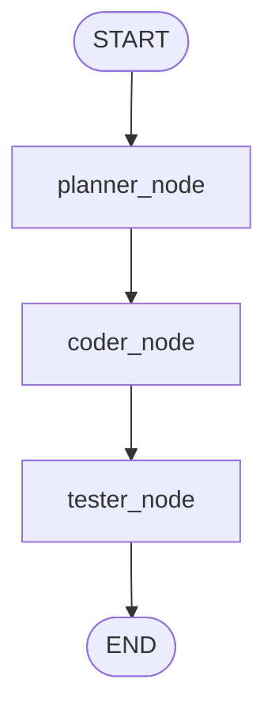
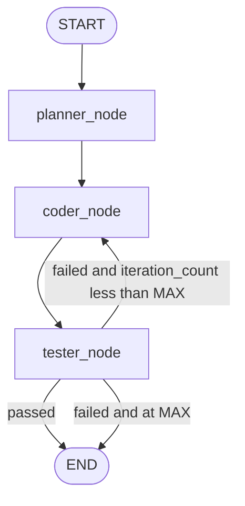
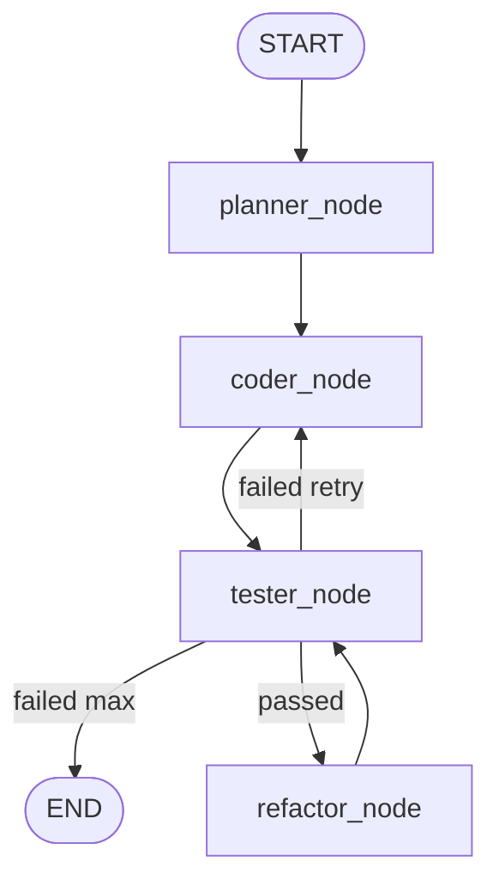

# Multi-Agent Code-Fix System — Architecture

Week 1 contract for the 8-week Option C system. **State schema and graph topology in this document are locked** for Planner, Coder, Tester, and Refactor work in Weeks 2–6. Change them only with an explicit schema revision.

## 1. System architecture overview

The system is a **LangGraph** workflow. Four logical agent nodes share one typed state object (`AgentState`):

| Node | Week | Role |
|------|------|------|
| `planner_node` | 2 | Read `spec`, write a step-by-step `plan` |
| `coder_node` | 3–4 | Turn `plan` (+ optional test failures) into `code` |
| `tester_node` | 5 | Execute pytest against `code`, write `test_results` |
| `refactor_node` | 6 | Improve passing code (clarity, complexity) without changing behavior |

Week 1 compiles a **linear skeleton** of three **passthrough** nodes (`planner` → `coder` → `tester`). `refactor_node` is specified here but is **not** wired until later weeks.

All nodes read and write the same `AgentState`. Downstream agents must not invent extra required fields without updating this document and `agent/state.py` together.

## 2. State schema table

| Field | Type | Default | Description |
|-------|------|---------|-------------|
| `spec` | `dict` | `{}` | Loaded function specification (signature, docstring, constraints, examples). |
| `plan` | `str` | `""` | Natural-language or structured plan from the planner. |
| `code` | `str` | `""` | Source text of the candidate implementation. |
| `test_results` | `dict` | `{}` | Tester payload: pass/fail counts, failure messages, captured output. |
| `iteration_count` | `int` | `0` | Number of coder↔tester retry cycles completed. |
| `status` | `str` | `"idle"` | Workflow status (see enum below). |

### 2.1 `status` enum (locked)

| Value | Meaning |
|-------|---------|
| `idle` | Initial state; graph not started. |
| `planning` | Planner is running or has just claimed the spec. |
| `coding` | Coder is producing or updating `code`. |
| `testing` | Tester is executing the suite. |
| `refactoring` | Refactor node is rewriting passing code. |
| `passed` | Current tests all passed. |
| `failed` | Tests failed; retry may be allowed. |
| `error` | Unexpected runtime or graph error. |

### 2.2 `test_results` shape (recommended)

Nodes may store extra keys, but Weeks 5+ should populate at least:

```text
{
  "passed": int,
  "failed": int,
  "total": int,
  "failures": [ { "test": str, "message": str } ],
  "stdout": str
}
```

### 2.3 Control constants (not state fields)

| Constant | Value | Notes |
|----------|-------|--------|
| `MAX_ITERATIONS` | `3` | After this many failed test loops, stop on `failed` (Week 5+). |

## 3. Node definitions

### `planner_node(state) -> partial state`

- **Reads:** `spec`
- **Writes:** `plan`, `status="planning"` (then later nodes overwrite status)
- **Week 1:** passthrough; copies spec title into a stub plan string.

### `coder_node(state) -> partial state`

- **Reads:** `spec`, `plan`, `test_results` (on retry), `iteration_count`
- **Writes:** `code`, `status="coding"`
- **Week 1:** passthrough; writes a stub comment as `code`.

### `tester_node(state) -> partial state`

- **Reads:** `code`, `spec`
- **Writes:** `test_results`, `status` (`testing` then `passed` / `failed` / `error`), may increment `iteration_count` on failure (Week 5+)
- **Week 1:** passthrough; writes an empty passing stub report and `status="passed"`.

### `refactor_node(state) -> partial state`

- **Reads:** `code`, `spec`, `test_results` (must already be passing)
- **Writes:** `code`, `status="refactoring"`
- **Week 1:** defined only in this document; **not** added to the compiled graph.

## 4. Graph topology and control flow

### 4.1 Week 1 — linear skeleton (implemented)

```text
START
  │
  ▼
planner_node
  │
  ▼
coder_node
  │
  ▼
tester_node
  │
  ▼
 END
```



### 4.2 Weeks 5+ — conditional retry

If tests fail and `iteration_count < MAX_ITERATIONS`, return to the coder. Otherwise end as `failed`.

```text
START → planner → coder → tester
                         │
            ┌────────────┴────────────┐
            │ passed                  │ failed
            ▼                         ▼
           END              iteration_count < MAX ?
                            │ yes              │ no
                            ▼                  ▼
                          coder               END (failed)
```



### 4.3 Week 6 — refactor path

After a **passed** suite, optionally run refactor, then re-test.

```text
tester --passed--> refactor_node --> tester --> END
tester --failed--> (retry coder or END as in 4.2)
```



Routing functions (later weeks) must key off `status` and `iteration_count` only, plus the constants above.

## 5. Directory layout

```text
agentic-code-fixer/
├── agent/
│   ├── state.py          # AgentState TypedDict (this schema)
│   └── graph.py          # compiled StateGraph
├── docs/
│   └── architecture.md   # this file
├── specs/
│   ├── spec_01.json … spec_08.json
│   ├── reference/        # ground-truth implementations
│   └── tests/            # 5 pytest cases per spec
├── scratch/
│   └── test_llm.py
├── requirements.txt
└── README.md
```

## 6. Observability

LangSmith tracing is enabled by environment variables (`LANGCHAIN_TRACING_V2`, `LANGCHAIN_API_KEY`, `LANGCHAIN_PROJECT`). Graph runs from `python agent/graph.py` should appear as a single trace with three node spans once tracing is configured.
